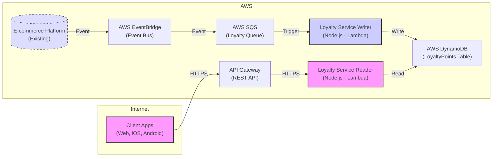

# Otrium Loyalty Program - Architecture

This document describes the architecture of the Otrium loyalty program, as represented in the following Mermaid diagram.

## Diagram

## Components

The architecture is composed of the following key components, all running within the AWS cloud:

*   **Client Apps (Web, iOS, Android):**  The user-facing applications where customers interact with the loyalty program (view points, redeem rewards, etc.).  These applications communicate with the backend via HTTPS requests to API Gateway.
*   **API Gateway (REST API):**  An AWS API Gateway instance configured to handle RESTful API requests. It serves as the front door for client applications to interact with the Loyalty Service Reader.
*   **E-commerce Platform (Existing):**  Otrium's existing e-commerce system.  This system publishes "order completed" events to AWS EventBridge.
*   **AWS EventBridge (Event Bus):**  A serverless event bus that receives events from the E-commerce Platform.  A rule is configured to forward relevant events (specifically, "order completed" events) to an SQS queue.
*   **AWS SQS (Loyalty Queue):**  A standard SQS queue that acts as a buffer for "order completed" events.  This decouples the E-commerce Platform from the Loyalty Service Writer, ensuring reliable event delivery and allowing for asynchronous processing.
*   **Loyalty Service Writer (Node.js - Lambda):**  An AWS Lambda function that is *triggered* by messages arriving in the SQS queue.  It is responsible for:
    *   Processing the "order completed" event.
    *   Calculating the earned loyalty points based on the order details.
    *   Updating the user's points balance in the DynamoDB table.
*   **Loyalty Service Reader (Node.js - Lambda):**  An AWS Lambda function that is triggered by HTTP requests from API Gateway.  It is responsible for:
    *   Receiving requests for a user's points balance (e.g., `GET /points/{userId}`).
    *   Retrieving the points balance from the DynamoDB table.
    *   Returning the points balance in the HTTP response.
*   **AWS DynamoDB (LoyaltyPoints Table):**  A NoSQL database that stores the loyalty program data, including user IDs, points balances, and reward history.

## Data Flow

1.  **Purchase Event:** A customer completes a purchase on the existing E-commerce Platform.
2.  **Event Publication:** The E-commerce Platform publishes an "order completed" event to AWS EventBridge.
3.  **Event Routing:** An EventBridge rule forwards the event to the AWS SQS Loyalty Queue.
4.  **Asynchronous Processing:** The Loyalty Service Writer Lambda function is triggered by the message in the SQS queue.
5.  **Points Calculation and Update:** The Loyalty Service Writer calculates the earned points and updates the user's record in the DynamoDB table.
6.  **Client Request:**  When a client app needs to display the user's points balance, it sends an HTTPS request to API Gateway.
7.  **Data Retrieval:** API Gateway routes the request to the Loyalty Service Reader Lambda function.
8.  **Response:** The Loyalty Service Reader retrieves the points balance from DynamoDB and returns it to the client app via API Gateway.

## Key Design Principles

*   **Serverless:** The architecture utilizes serverless components (Lambda, API Gateway, EventBridge, SQS, DynamoDB) for scalability, cost-effectiveness, and reduced operational overhead.
*   **Asynchronous Processing:** The use of SQS decouples the E-commerce Platform from the Loyalty Service Writer, enabling asynchronous processing of purchase events and improving system resilience.
*   **Single Responsibility Principle:** The Loyalty Service is split into two Lambda functions, each with a single, well-defined responsibility (writing updates and reading data). This promotes maintainability and independent scaling.
*   **Event-Driven Architecture:** The system is event-driven, with EventBridge acting as the central event bus. This allows for future extensibility and integration with other systems.
*   **Real-time Backend Updates:** The loyalty points are updated in the database in real-time (as soon as the purchase event is processed), even though the user interface retrieves the data on demand.

This architecture provides a robust, scalable, and cost-effective solution for Otrium's loyalty program.
